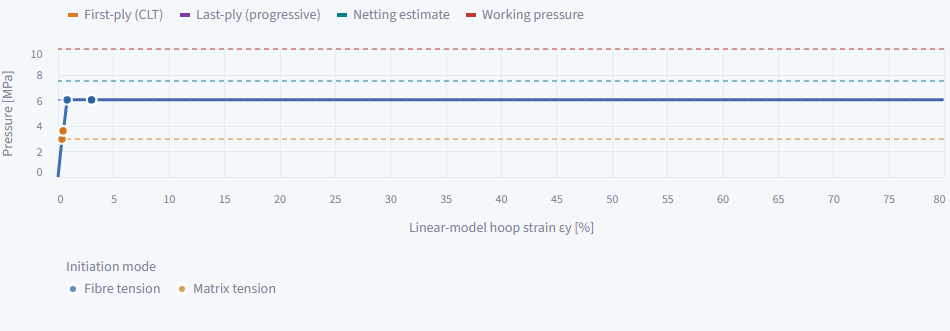

# Composite Laminate Design & Analysis Tool

**Live app:** <https://composite-laminate-tool.streamlit.app/>  ·  **Author:** Artyom

The public app runs on Streamlit Community Cloud, independently of the developer's computer. Opening `localhost` is only for local development; use the public link above when the computer is off. The free service sleeps after 12 hours without visitors; anyone with viewing access can click **Yes, get this app back up!** to wake it. See [Community Cloud hibernation](https://docs.streamlit.io/deploy/streamlit-community-cloud/manage-your-app#app-hibernation). Updates pushed to the deployed GitHub branch are copied to the cloud automatically. The four local reference documents in `verification/sources/` are excluded from Git and public source downloads; numeric verification runs without them.

A Streamlit application that makes Classical Lamination Theory (CLT) visible step by step:

`material → Q → Q̄ → stacking sequence → ABD → mid-plane strain and curvature → ply stresses → first-ply failure (Maximum Stress, Tsai–Wu, Hashin) → progressive failure to the last ply`

You choose the material (two cited datasets or your own values), the layup (angle, thickness and material of every ply, so hybrid stacks are possible) and the six load resultants (`Nx, Ny, Nxy, Mx, My, Mxy`). Every tab shows the equation, the numbers and a short interpretation. The app also gives the laminate's equivalent engineering constants (Ex, Ey, Gxy, νxy, flexural moduli) and exports a PDF report of the current analysis.

Further tabs compare 2–5 candidate layups, screen a filament-wound cylinder under internal pressure (first-ply pressure from CLT, the progressive-failure last-ply pressure and the netting-theory burst estimate, with the ±54.7° winding angle) and a geodesic dome, connect the model to manufacturing processes and defects, show two application examples, and check the code against a published worked example.

## Run locally

```powershell
python -m pip install -r requirements.txt
streamlit run app.py
python -m unittest discover -s tests -v
```

On Windows, double-clicking `START_APP.cmd` creates a virtual environment, installs the dependencies and opens the app; `START_APP.cmd --check` runs the tests only.

## Conventions

- SI units internally (Pa, m, N). Display: moduli and stresses in GPa/MPa, thickness in mm, sidebar forces in N/m and moments per width in N·m/m (= N), A in MN/m, B in N, D in N·m, strain in µε, curvature in 1/m. Existing load presets retain their physical values.
- Plane-stress order `[σ1, σ2, τ12]` and `[ε1, ε2, γ12]`, with engineering shear strain.
- Positive ply angle: counter-clockwise from the global x-axis to the fibre axis 1.
- Plies are listed from the `−h/2` face to the `+h/2` face; `z` is measured upward from the mid-plane.

## Code layout

| Path | Content |
|---|---|
| `core/` | CLT mechanics: `Q`, `Q̄`, `A/B/D`, engineering constants, laminate response, Maximum Stress, Tsai–Wu and Hashin (`failure.py`), progressive failure (`progressive.py`), cylinder resultants and netting theory, geodesic dome (`dome.py`) |
| `workflow.py` | Layup parsing, ply-table validation, symmetry/balance checks, design summaries, pressure-vessel screening |
| `report.py` | Existing PDF export: compact mechanical laminate summary, plus cylinder results and pressure-strain curve when exported from Pressure vessel; ReportLab and bundled DejaVu fonts |
| `materials/` | Reference material data with sources |
| `examples/` | Wind-blade spar-cap example (unsymmetric thick panel) |
| `app.py` | Streamlit interface |
| `verification_view.py` | Fixed Kaw source/app comparison, independent of sidebar inputs, with midpoint recovery and source-digit tolerances |
| `tests/` | Automated tests (R0 baseline: 146; current run evidence in `verification/AUDIT.md`) (snapshot of key numbers, mechanics properties, reference values, hybrids, bending, engineering constants, pressure vessel, dome, Hashin, progressive failure, thermal response, optimiser, review regressions, app wiring, report, input validation) |
| `verification/` | Reference-value script, the engineering audit log (`AUDIT.md`) and the verdicts on the two independent reviews: dome (`REVIEW_C3.md`) and Hashin / progressive failure (`REVIEW_C4.md`) |
| `validation/` | Burst-test cases (`data.json`, unverified), the runner `run_validation.py`, `results.json`, tables and chart in `README.md`; result: no like-for-like comparison was possible (see its README) |
| `reports/` | Report No. 2 (PDF) and its generator |

## Thermal stresses (C5)

The compact block in the Failure tab calculates transformed ply CTEs, thermal resultants, free expansion/curvature, residual ply stresses and optional combined mechanical stresses. Its first-ply factor scales only the mechanical loads while holding the thermal stress fixed. Direct ΔT and reference-to-final cooling are available; the chosen low temperature is a scenario input. The general PDF and other tabs retain their mechanical-load calculations.

CTEs are sourced from [York (2015), Table 2](https://eprints.gla.ac.uk/105827/1/105827.pdf). For T300/5208, [NASA-CR-162921](https://ntrs.nasa.gov/citations/19800012968) uses 250 °F as a Hahn-approximation stress-free temperature in its residual-stress calculations and says it is considerably below the 350 °F nominal cure; it does not report a measured 250–300 °F stress-free range. For Scotchply 1002, the `SOURCED` label means the 330 °F press-cure temperature comes from [3M technical data, §1.8](https://digital.library.unt.edu/ark:/67531/metadc1064666/m2/1/high_res_d/5389797.pdf); the app assumes that cure temperature as its stress-free reference, not a measured stress-free temperature. Hybrid thermal cooling uses one user-assumed stress-free reference temperature for all plies, so material-specific references are not combined algebraically. Values and provenance are recorded in `validation/data.json`; custom thermal data remain unavailable without a source. Cryogenic results extrapolate constant properties; moisture, creep and temperature-dependent properties are not modelled.

## Cylinder layup optimiser

`core/optimise.py` exposes `optimise_cylinder(radius_m, n_plies, ply_thickness_m, material, strengths, allowed_angles=DEFAULT_ANGLES, objective='first_ply', max_candidates=128, seed=2026)`. It searches symmetric angle-count vectors in canonical mirrored order: small spaces are exhausted; larger spaces use homogeneous and balanced anchor vectors plus fixed-seed count sampling. The result reports the number evaluated versus the full symmetric count space. With ply count, thickness and material fixed, all candidates have the same mass; the optimiser does not invent density. The core accepts any positive ply count; the UI retains the multiple-of-four requirement for its balanced netting comparison.

The ranked top five can use `first_ply` (the existing Maximum Stress/Tsai–Wu minimum), `last_ply` (the existing Hashin progressive-failure stopping point), or `fibre_limit` (a netting-theory projection upper bound, not a CLT fibre-rupture prediction). Every candidate is evaluated for both first-ply failure and progressive stopping, using the supplied degradation rules. Results are compared with the continuous netting-theory reference, θ = atan(√2) and p = 2Xt h/(3R); a ±θ CLT/progressive comparison is included only when n is divisible by four. This compact button-run UI reports candidates and does not apply a result to the current layup. Changed inputs hide stale rankings until the search is rerun. Unbalanced stacks allow CLT shear strain without end restraints; their exact fibre-only netting pressure is not reported because the existing axial/hoop solver does not enforce shear equilibrium. Ties at 12 significant digits prefer balanced stacks nearest the netting angle, then lexicographic angles. The fixed-seed search is a bounded sample, not a global-optimality guarantee, and neither the netting bound nor these screening predictions are burst validated. Netting is a separate fibre-only model, not an upper bound on matrix-bearing CLT.

Reproduce the end-of-task thermal PDF with `python reports/make_report_c5.py` (existing ReportLab dependency). The complete source-controlled test suite is `python -m unittest discover -s tests -v`. Obsolete local tests and scratch files were moved outside the repository; see `verification/CLEANUP_2026-10-08.md` for the recoverable archive and retained files.

## Kaw verification and ply forces

The Response tab integrates global Nx, Ny and Nxy through each ply exactly, including curvature effects; zero applied components have n/a shares. The Verification tab compares fixed [30/-45/-60] glass/epoxy source inputs with fresh Qbar/ABD, midplane, local strain/stress and ply-force results at the same numeric z. Source Top corresponds to app Bottom in this algebraic comparison; engineering shear and app conventions are unchanged.

Sources and precision notes: `verification/VERIFY_KAW_4_3.md`, `verification/KAW_SOURCE_TRANSCRIPTION.md` and `verification/VERIFY_DOC2_COMPARISON.md`. The full local stress table is from the supplied Doc2 image; its original publication page is NOT REPORTED. `python verification/verify_kaw_vessel.py` reproduces the PDF check and app-default cylinder arithmetic. [Russian pressure-vessel guide](docs/PRESSURE_VESSEL_EXPLAINED_RU.md) explains the tab; `verification/VERIFY_VESSEL_EXAMPLE.md` reproduces Roylance's equilibrium angle and explicitly leaves pressure/burst validation unresolved.

## Refinement v4

The existing eleven tabs now show a shared failure-mode palette, a fifteen-term glossary, input-scope hints, model-assumption badges and the unchanged experimental-validation gap. Pressure-strain event points use the solver's pre-damage states; dome shading uses the existing `membrane_valid` flags. The cylinder PDF keeps 4-, 16- and 40-ply examples on one page and reports first-ply, the assumed last-ply model stop and a separate fibre-only netting reference. The general export still uses sidebar mechanical loads; thermal preload and dome results are excluded from the PDF.

No physics module, dependency, tab or navigation mode was added. `core/`, source material values and `tests/snapshot_v3.json` remain unchanged. See `verification/AUDIT.md` for stage evidence and incomplete checks. Optional R6 remains dependent on the original paper pages (user task A5); personal tasks A1-A5 remain the user's work.



Current recorded suite: **175 tests passed, 0 skipped** (`verification/qa_results.json`, refreshed by `python verification/run_refine_qa.py`). Independent thermal/optimiser review: `verification/REVIEW_thermal_optimise.md`; text review: `verification/TEXT_REVIEW_G2.md`; input cases: `verification/ROBUSTNESS_R5.md`. The saved sample export is `output/pdf/V4_screening_sample.pdf`.

For the professor-facing demonstration, use [the five-minute route](DEMO_ROUTE.md) and [the limitations memo](LIMITS_BEFORE_SHOW.md). The final reader review is in `verification/PROFESSOR_PASS.md`. The quiz follows the entered material, thermal/no-load wording is separated, and unbalanced netting and large-strain extrapolation are explicitly qualified. The PDF records the actual sidebar elastic and strength inputs.

## Data sources

- Lamina data: the classic T300/5208 graphite/epoxy and Scotchply 1002 glass/epoxy values (Tsai & Hahn, *Introduction to Composite Materials*, 1980; Kaw, *Mechanics of Composite Materials*, 2nd ed., CRC Press, 2006), as tabulated in [Martinez & Bishay, *Composites Part C* (2021), Table 2](https://www.csun.edu/~pbishay/pubs/Martinez_Bishay_CPC_2020.pdf). The 0.125 mm ply thickness is an illustrative value.
- Verification: the `[0/90]s` stiffness is compared with a [published worked CLT example](https://mpolyco.com/learn/classical-laminate-theory) (`A₁₁ = 48.039 MN/m`, `D₁₁ = 1.671 N·m`).
- Spar-cap example: glass material data from Sandia report SAND2011-3779 (SNL100-00 blade), Table 19.
- Pressure vessel: thin-wall equilibrium and netting analysis as in standard filament-winding texts (e.g. S. T. Peters (ed.), *Composite Filament Winding*, ASM International, 2011).
- Manufacturing and aerospace context: [FAA AC 21-26A](https://www.faa.gov/documentLibrary/media/Advisory_Circular/AC_21-26A.pdf), [FAA AC 20-107B](https://www.faa.gov/airports/resources/advisory_circulars/index.cfm/go/document.information/documentNumber/20-107B).

## How AI was used

The code was written with AI coding assistants, working under written rules. [AGENTS.md](AGENTS.md) fixes the units, sign conventions and the rule that equations in `core/` change only with an engineering justification and a regression test. [CLAUDE.md](CLAUDE.md) is the brief for a separate AI review pass. AI output was accepted only after the equations, units, limiting cases and the published example were checked. The review passes found real problems (a wrong reference value in a test, hidden default strengths, a wrong formula in a UI caption, a failure of the Tsai–Wu strength ratio under pure bending); each was fixed and covered by a test. Two AI models reviewed each other's work: one wrote and ran the code, the other reviewed the dome module and the Hashin / progressive-failure code, and the first checked the second's research data. Every review comment was verified before acting; the confirmed and rejected comments are listed in [verification/AUDIT.md](verification/AUDIT.md).

## Limitations

Linear-elastic plies in plane stress, perfect bonding and thin-plate (Kirchhoff) kinematics. Thermal residual stresses are available only in the Failure tab thermal block. Moisture, creep, temperature-dependent properties, chemical shrinkage, transverse shear, interlaminar stresses, delamination and buckling are excluded. Hashin is a plane-stress, Hashin-1980-inspired initiation criterion (alpha = 1 is a chosen setting; the transverse shear strength Yc/(2 tan 53°) is assumed when none is given). Progressive failure remains mechanical-load-only and is a ply-discount screening model: its degradation factors (E1 ×0.01 after fibre failure, E2 and G12 ×0.1 after matrix failure) and two-level termination rule are assumptions. Last-ply pressure is the algorithm's stopping point, not a validated burst load; it depends on degradation factors and unsymmetric stack order. The cylinder uses one computational ply per physical ply and no stability analysis. Open holes, fatigue, impact, manufacturing defects, fibre kinking, crack growth and leakage are excluded. Published burst comparisons remain incomplete because source radii and Type III liner properties are missing. The dome uses membrane theory with helical plies only (no end-fittings, liner or slip); junction and polar-opening zones are not strength predictions. Strengths are literature values, not qualified allowables; Tsai–Wu uses the assumed interaction F12 = −0.5√(F11·F22). This is an educational screening tool.
