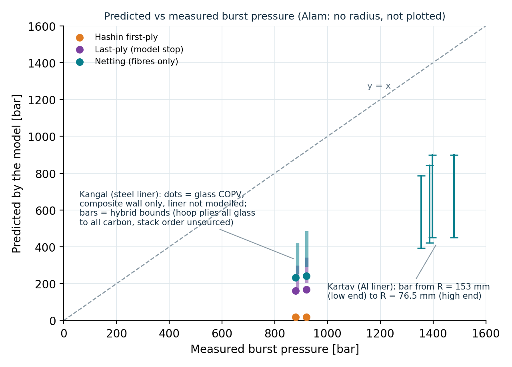

# validation/ — model run on the burst-test cases (Task C4)

Reproduce: `python validation/run_validation.py` then `python validation/make_outputs.py` (rewrites `results.json`, the chart and the tables below).
Input is `data.json`, which is UNVERIFIED research text (see Part A). **No parameter was tuned to any measurement.** Rows called "sensitivity" change one
input to show how much it matters; they are never the prediction.

## Result in short

**None of the cases supports a pass/fail comparison, and none shows that the model predicts burst pressure.** Reasons, in order of weight:

1. **The inner radius is NOT REPORTED in any of the four sources**, and pressure scales as 1/R. For Alam (the only case without a metal liner) no pressure can be given, only p·R and the radius at which the prediction would equal the measurement (Table 3). That radius, 45–52 mm, must be compared with Figures 1–3 of the paper by a human.
2. **The two Type III cases have a metal liner** (34CrMo4 steel; Al 6061-T6) whose properties are UNSOURCED and which the model does not contain. The model gives the capacity of the composite wall alone, so its prediction is far below the measured total (Kangal glass: netting 0.26 of the measured burst, Table 1). That is expected, not a model error, and not a validation either.
3. **The one plausibility check available** is the measured gain over the bare liner: Kangal glass COPV 919/879 bar minus the mean bare liner 657 bar = 262/222 bar, against a netting estimate of 242/232 bar (ratios 0.92 and 1.05). This is NOT agreement: the steel liner yields, the liner and the composite do not share the load additively, and the bare-liner tests alone scatter by 622–692 bar (±35 bar, about ±15 % of the gain).
4. **The Kartav radius is inconsistent as published.** With R = 153 mm the fibre-only estimate is 29–32 % of the measured burst of the configurations that failed in the cylinder; reading 153 mm as a diameter (R = 76.5 mm) gives 58–64 %. Neither reading is checked against Figure 1.

## What the numbers do show (about the model, not about the vessels)

* **The first-ply value is not a burst estimate.** CLT/Hashin first-ply is 18–19 bar for Kangal glass (matrix tension in the ±11° plies, whose transverse strain limit Yt/E2 is about 0.2 %), about 2 % of the measured burst. First-ply failure and burst differ by an order of magnitude here, as expected.
* **The last-ply value depends on things the data do not give.** For the same 12 plies the last-ply (model stop) is 168 bar in the notated order, 243 bar with hoop plies interleaved ([90,+11,-11,90]x3) and 64 bar with helical and hoop plies in blocks (Table 2). The stack order is UNSOURCED, the wall is unsymmetric, and free-plate CLT lets an unsymmetric wall curve, which a restrained vessel wall does not; bending-extension coupling then drives the surface stresses. The fibre-only netting value does not depend on the order.
* **The residual factors move the last-ply value by a factor of 3.5** (48–168 bar over E1 retained 0.001–0.5). The transverse shear strength has no effect in these tension-dominated pressure states (matrix compression is never active), and keeping or removing E2 and G12 after a fibre failure changes nothing here because the last-ply value is reached in the load step where the hoop fibres first fail.
* **Last-ply stays below netting for the notated stack (168 vs 242 bar)** and reaches it (243 vs 242 bar) only for the interleaved stack. The last-ply value is where this discount algorithm stops, not a measured or validated ultimate pressure.

## Likely causes of the mismatches (what is known and what is not)

* **Liner (dominant for Type III):** not modelled; the measured total includes the load carried by the steel or aluminium liner (bare steel liner 622–692 bar).
* **Dome and end effects:** the model is a cylinder wall. Kartav ALCF1–9 failed in the domes, so a cylinder model does not apply to them at all; for the Kangal vessels the paper reports mostly cylindrical failure, but the domes and the ends are different between the front and back of the vessel.
* **Fibre strength translation:** the netting estimate uses the ply tensile strength Xt of the lamina card as the fibre strength; the translation from fibre to ply to vessel (Table 2 of Kangal: Xt 1250 MPa) is not demonstrated for this process.
* **Geometry and layup not published or ambiguous:** radius, polar opening, dome profile, stack order, thickness distribution (0.2 mm FE vs 0.208/0.199 mm measured, Kangal hybrid 0.25/0.217 mm).
* **Scatter:** the two GF tests differ by 4.5 % (919 vs 879 bar), the bare liners by 11 %, Kartav ALCF11 and ALCF12 (same configuration) by 6 %. A model closer than that to a single test would not be evidence.
* **Strength inputs:** the lamina cards are reported values, partly OCR-damaged (Part A, flags 4, 5, 8); the same carbon card appears in two papers.

## Derived radius for Kangal (the only derived geometry)

Table 1 of the paper labels its diameters only "average". (COPV diameter − liner diameter)/2 equals 12 × the measured ply thickness (GF P1: 2.50 vs 2.496 mm; hybrid P1: 2.995 vs 3.0 mm), so the liner diameter is the liner outer diameter and the composite starts at r = 70.1 mm. Pressure acts on the liner bore: r = 70.1 − 4.5 mm (average liner wall) = 65.6 mm, used as R. The composite inner radius 70.1 mm is run as a sensitivity (about −6 % on every pressure). P1 and P2 of Table 1 are assumed to be the same vessels as P1 and P2 of Table 4. This is an inference from pasted numbers, not published data.

## Results

<!-- C4-TABLES-START -->
**Table 1. Kangal 2020, glass-fibre COPV (Type III): model of the composite wall only vs the measured TOTAL burst of the vessel (bar).** Radius derived from Table 1 (see below), ply thickness as measured, stack as notated, assumed transverse shear strength, default degradation factors.

| Specimen | Measured | Paper FE | CLT first-ply | Hashin first-ply | Last-ply (model stop) | Netting | Netting / measured | Measured minus mean bare liner (657) | Netting / that gain |
|---|---|---|---|---|---|---|---|---|---|
| GF_P1 | 919 | 953 | 18.9 | 18.9 | 167.8 | 242.3 | 0.26 | 262 | 0.92 |
| GF_P2 | 879 | 953 | 18.1 | 18.1 | 160.7 | 232.1 | 0.26 | 222 | 1.05 |
| HY_P1 (bounds) | 922 | 943 | 22.7 to 46.7 | 22.7 to 46.7 | 201.6 to 341.9 | 291.2 to 484.6 | 0.32 to 0.53 | n/a | n/a |
| HY_P2 (bounds) | 887 | 943 | 19.8 to 40.6 | 19.7 to 40.6 | 175.2 to 297.1 | 253.1 to 421.1 | 0.29 to 0.47 | n/a | n/a |

Hybrid rows are bounds (all hoop plies glass, all hoop plies carbon) because the 12-ply hybrid stack order is UNSOURCED; they are not predictions.

**Table 2. SENSITIVITY (not predictions): GF_P1, one change at a time (bar).**

| Change from the primary run | CLT first-ply | Hashin first-ply | Last-ply (model stop) | Netting |
|---|---|---|---|---|
| primary run | 18.9 | 18.9 | 167.8 | 242.3 |
| radius = composite inner radius | 17.7 | 17.7 | 157.0 | 226.7 |
| stack order [90,+11,-11,90]x3 (hoop plies on both sides of each helical pair) | 22.3 | 22.3 | 243.4 | 242.3 |
| stack order [+11,-11]x3 then 90x6 (blocks) | 13.1 | 13.1 | 63.9 | 242.3 |
| ply thickness 0.2 mm (FE value) instead of measured | 18.2 | 18.2 | 161.3 | 233.0 |
| Hashin St = S12 (assumed) instead of Yc/(2 tan 53) | 18.9 | 18.9 | 167.8 | 242.3 |
| Hashin St = 0.5 S12 (assumed) instead of Yc/(2 tan 53) | 18.9 | 18.9 | 167.8 | 242.3 |
| residual factors E1 0.001 / E2,G12 0.01 | 18.9 | 18.9 | 167.9 | 242.3 |
| residual factors E1 0.1 / E2,G12 0.3 | 18.9 | 18.9 | 114.6 | 242.3 |
| residual factors 0.5 / 0.5 / 0.5 | 18.9 | 18.9 | 47.9 | 242.3 |
| fibre failure also removes E2, G12 (x0.1) | 18.9 | 18.9 | 167.8 | 242.3 |

**Table 3. Alam 2020, T800S Type IV: no pressure can be predicted (inner radius UNSOURCED).** Stack [-13, +13, 88, -13, +13], ply thicknesses 0.033/0.033/0.009/0.033/0.033 in, S_T = S_L = 14 ksi from the pasted text. Measured bursts 2282, 2327, 2391 psi (mean 2333 psi = 16.09 MPa). The model gives p R; the predicted pressure is (p R)/R for the radius R read from Figures 1-3.

| Quantity | p R [kN/m] | Radius at which it would equal the measured mean burst [mm] |
|---|---|---|
| CLT first-ply | 725 | 45 |
| Hashin first-ply | 719 | 45 |
| Last-ply (model stop) | 833 | 52 |
| Netting (fibres only) | 789 | 49 |

**Table 4. Kartav 2021 (Al liner, Type III): netting diagnostic only, configurations whose failure was reported in the cylindrical mid-region (bar).**

| Config | Measured | Netting, R = 153 mm (as published) | Netting, 153 mm read as a diameter (R = 76.5 mm) |
|---|---|---|---|
| ALCF10 | 1355 | 393 | 786 |
| ALCF11 | 1397 | 449 | 898 |
| ALCF12 | 1480 | 449 | 898 |
| ALCF13 | 1387 | 421 | 842 |
<!-- C4-TABLES-END -->

Full numbers, inputs and failure sequences are in `results.json`. Not run, with reasons: total burst of the Type III vessels (liner properties UNSOURCED); the hybrid prediction (stack order UNSOURCED); Kartav CLT/Hashin/last-ply (ply order UNSOURCED, dome failures); any pressure for Alam (radius UNSOURCED); Lüders 2025 (burst value only in the Zenodo CSV).

---

# Part A. The data and its status (Task C1)

**Status of the input:** everything here comes from ChatGPT research text pasted into the task (G1, G2). It is treated as UNVERIFIED. No original PDF was opened, nothing was filled from memory. `UNSOURCED` in `data.json` means "absent from the pasted text".

## Bottom line

No case fully meets the rule "geometry + layup + lamina properties + measured burst all given": **inner radius is NOT REPORTED in all four sources.** `data.json` therefore lists `strict_usable_cases: []`. Three cases are included as **CONDITIONAL** (gaps marked `UNSOURCED`); one is excluded.

| Case | Status | What blocks it |
|---|---|---|
| Kangal 2020 (Type III, steel) | CONDITIONAL, best candidate | inner/polar radius, dome profile, 34CrMo4 properties |
| Alam 2020 (Type IV, T800S) | CONDITIONAL, cleanest laminate | all geometry (Figures 1-3 only) |
| Kartav 2021 (Type III, Al) | CONDITIONAL, weakest | radius fails netting check, ply order, Al properties, OCR-damaged values |
| Lüders 2025 (Type IV, PA12) | EXCLUDED | burst value only in Zenodo CSV, not in article text |

Lamina-only data from part 1 of the task (T300/5208, E-glass/epoxy, T700/epoxy) has no vessel or burst value, so it is not a validation case here.

## Cases and comparison plan

**Kangal 2020** — liner 4.5 mm wall; laminate [±11/90₂]₃ (12 plies, 0.2 mm/ply); glass and carbon lamina cards (Table 2); individual bursts (Table 4): bare liner 622/692, GF 919/879, hybrid 922/887 bar; paper FE 644/953/943 bar.
Compare: model burst for GF and hybrid against **each individual test**, not the average; also report error vs the paper FE. Expected failure: cylinder, hoop layers. Target: within the ~8% the paper itself achieves. Needs the steel liner curve before the Type III load sharing can be run.

**Alam 2020** — five explicit plies [-13, +13, 88, -13, +13] with thicknesses 0.033/0.033/0.009/0.033/0.033 in; T800S/UF3323 lamina (Table 1, ksi); 3 bursts 2282/2327/2391 psi; paper FE 2237.5-2300 psi.
Compare: CLT + Hashin (S_L = S_T) first-ply and last-ply failure vs the three bursts (mean 2333 psi). Expected failure: hoop region. Geometry must be read from Figures 1-3 first.

**Kartav 2021** — 13 configurations, ±14° helical + hoop + doilies, bursts 1018-1480 bar (Table 5), partial FE predictions. Use only after the radius question below is resolved. Useful later for dome/doily migration of the failure location.

**Lüders 2025 (not in data.json)** — full 7-layer winding table, PA12 liner, polar diameter 46 mm, tested SN03. Becomes usable once the burst event is extracted from `pressure_raw_SN03.csv` (Zenodo 10.5281/zenodo.10983652). The 200 bar in the article is design burst, not the measured value.

## Internal consistency checks (computed only from pasted numbers)

Netting estimates are crude (ply Xt, no knock-down, no liner contribution, hoop-limited) and are used only as plausibility screens.

**Passed**
- Kangal: bare liner/GF/hybrid averages 657/899/905 bar match the individual values.
- Kangal: (COPV Ø − liner Ø)/2 ≈ 12 × measured ply thickness (2.50 vs 2.50 mm GF P1; 3.00 vs 3.00 mm hybrid P1; P2 within ~0.1 mm). This assumes both Table 1 diameters are outer diameters, which the table does not label.
- Kangal: netting hoop estimate for the composite (6 hoop plies, R ≈ 71 mm) ≈ 218 bar vs the observed gain of the COPV over the bare liner of 242 bar; hoop-limited, matching the observed cylindrical failure. Rough only: liner/composite load sharing is not additive.
- Kartav: ±14° layer 0.25 mm and hoop 0.2 mm give 5.54 mm mean over the 13 configurations vs stated 5.5 mm average, supporting the reading "9 helical = 9 layers". The "mean over configurations" reading is itself my inference.
- Kartav: ply card E1 141 GPa against fibre 230 GPa implies Vf ≈ 0.61 (rule of mixtures, matrix neglected); Xt 2080 MPa is ≈ 0.70 of 0.61 × 4.9 GPa. Plausible.
- Alam: FE range 2237.5-2300 psi, midpoint 2268.75 = reported "average" (−2.8% vs mean test). Hoop-limited netting is consistent with the observed hoop failure.
- Lüders: layer thicknesses sum to 3.252 mm vs stated 3.25 mm.

**Flags (do not hide)**
1. **Kartav radius:** with R = 153 mm (as published, called "average radius") the composite hoop-limited estimate for ALCF1 is ≈ 399 bar, and even if the whole 5.5 mm were hoop fibre at Xt it would reach only ≈ 748 bar, below the measured 1018 bar. The Al liner would then have to carry a stress of ≈ 1580 MPa, far beyond any aluminium alloy. The 1400 bar target would need ≈ 10.3 mm of hoop fibre. With 153 mm read as a **diameter** (R = 76.5) the composite estimate is ≈ 797 bar, which is plausible. Cannot be resolved without Figure 1; Al properties are UNSOURCED.
2. **Kartav scatter:** ALCF11 and ALCF12 have identical configurations (9 helical, 16 hoop, 17/9 doilies) but burst at 1397 vs 1480 bar (6%). ALCF13 (15 hoop) at 1387 bar is below both.
3. **Kartav FE errors** are not uniform: ALCF5 +13.9%, ALCF1 −7.0%, others within ±4.4%. The FE values come from a text sentence, not a table.
4. **Kartav OCR:** E2 shown as 114 GPa (11.4 supported by Kangal's identical card, 11,400 MPa); G12 of the doily 175 GPa exceeds E1d = 60 GPa and is implausible, kept UNSOURCED.
5. **Same carbon card in two papers:** Kangal's A-49 carbon and Kartav's T700SC carbon have identical lamina values (141/11.4/5/0.28/2080/1250/60/290/110). Either the same group reused a card or one is mislabelled.
6. **Kangal FE accuracy:** GF FE 953 bar is +8.4% vs test P2 (879), slightly above the "within about 8%" claimed in the text.
7. **Kangal ply thickness:** hybrid measured ply 0.250 / 0.217 mm vs the 0.2 mm used in the FE model (+25% / +9%).
8. **Alam:** S_L = 14 ksi equals Y_T = 14 ksi exactly, which looks like a possible transcription duplicate; check typeset Table 1. Ply 3 angle is 88° in the layup table but +88° in the case notation. Fibre modulus for T800S is not in the pasted text, so the implied ≈ 295 GPa (176.8 GPa / 0.60) cannot be verified. The hoop-limited netting (Xt = 3365 MPa, ply thicknesses above) gives an upper bound of R ≈ 83 mm: if the drawings show a clearly larger radius, the laminate/burst pair is inconsistent.
9. **Lüders Table 4 turning radii:** the helical entries do not follow geodesic winding on the 206.2 mm outer liner radius (Clairaut gives R ≈ 154 mm for layer 1 and ≈ 193 mm for layer 7). The hoop turning radius of layer 2 (205.08 mm) is below the liner outer radius, and the step from layer 2 to 4 (2.62 mm) does not match the thickness build-up (≈ 0.93 mm). The column may not be a geometric radius; verify against the typeset table before use.
10. **Provenance:** Kartav and Kangal data are cited to Scribd/Studylib copies, Alam to ResearchGate; one Lüders line is attributed to "Europe's Rail", which cannot be a source for that paper. None of these were checked against the publisher versions. Page numbers are essentially absent from the pasted text; only table numbers are recorded.
11. **Compression sign convention:** Kangal/Kartav publish Xc, Yc as negative, Alam and Lüders as positive magnitudes. Normalise in code, not in the data.

## Next steps before any validation run

1. Read dimensions from Alam Figures 1-3 and Kangal/Kartav figures (inner radius, polar opening, dome profile).
2. Obtain steel 34CrMo4 and Al 6061-T6 properties from the original papers.
3. Extract the burst pressure from Lüders' CSV.
4. Compare typeset Tables against the OCR-affected values listed above.
